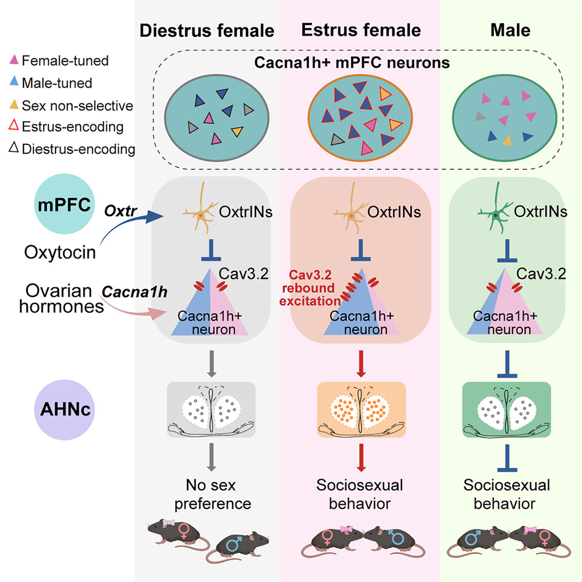

# 👩‍🔬 About Me 

**Hi, I am a PhD student in IDG/McGOVERN INSTITUTE, Tsinghua University.** Contact me through ying-zho22@mails.tsinghua.edu.cn

* * *

# 📰 News!  
* **I dived into computational neuroscience field in 2023.** Click here to visit our [lab website](https://jiaxx.github.io/).
* **I became a phD student in 2022.**

* * *

# 👩‍🎓 Education 

### - Ph.D in Computational Neuroscience
  * **Tsinghua University, Beijing**
  * _2022/09-2027/06 (expected)_

### - Bachelor in Biotechnology and Computer Science (The second degree)
  * **University of Electronic Science and Technology of China, Chengdu**
  * _2018/09-2022/06_

* * *

# 🧠 Interests

**My research interests include**

* **Dynamic Neural Network**:  My research topic is about dynamical neural network which aims to understand how information is propagated temporally and spatially in the brain. Are there any patterns of information flow? If so, what these patterns mean and how it correlation to the dynamical system theory? We hope to use dynamical neural network analysis as a tool to understand some basic problems of neuroscience.

* **NeuroAI Research**: Now, I am curious about the question about what's the difference between biological intelligence and artifical intelligence. How to improve the development of artificial general intelligence by studying the biological brain? 

* * *

# 💯 Learning Notes 
As a first-year doctoral student, learning new knowledge is an important event. I record and share my learning notes, meetings and seminar notes in [Computational Neuroscience Learning Notes](https://energetic-player-d0e.notion.site/Computation-Neuroscience-Learning-e6014d81cdad43e7b20f1d4b36cff4ae). Welcome to make comments.

* * *

# 💗 Lifes and hobbies
I hope to be a vibrant person. From time to time, I would go out to take photos. Currently, I am studying diving. Click [Zoey's Club](https://www.notion.so/Colorful-Life-and-Hobbies-3adaeba927344b9891c90acd84e88dbc) to see photos.

* * *

# 🌼 Publications
<table border="2">
  <tr>
    <td width="60%">
       
Wang Yuping*, Xinli Song*, Xiangmao Chen*, <b>Ying Zhou*</b>, Jihao Ma*, Fang Zhang*, Liqiang Wei*, Kun Li# et al. "Integrating reproductive states and social cues in the control of sociosexual behaviors." Cell (2025).

       
<small> Female sociosexual behaviors, essential for survival and reproduction, are modulated by ovarian hormones and triggered in the context of appropriate social cues. Here, we identify primary estrous-sensitive Cacna1h-expressing medial prefrontal cortex (mPFCCacna1h+) neurons that integrate hormonal states with recognition of potential mates to orchestrate these complex cognitive behaviors. Bidirectional manipulation of mPFCCacna1h+ neurons shifts opposite-sex-directed social behaviors between estrus and diestrus females via anterior hypothalamic outputs. In males, these neurons serve opposite functions compared with estrus females. Miniscope imaging reveals mixed representation of self-estrous states and social target sex in distinct mPFCCacna1h+ subpopulations, with biased encoding of opposite-sex cues in estrus females and males. Mechanistically, ovarian-hormone-induced Cacna1h upregulation enhances T-type rebound excitation after oxytocin inhibition, driving estrus-specific activity changes and the sexually dimorphic function of mPFCCacna1h+ neurons. These findings uncover a prefrontal circuit that integrates internal hormonal states and target-sex information to exert sexually bivalent top-down control over adaptive social behaviors.
       <a href="https://www.cell.com/cell/abstract/S0092-8674(25)00505-7">[Paper Link]</a>
    <td width="40%">
      
    </td>
