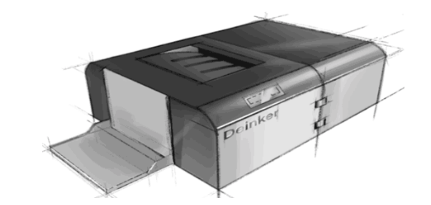

# 👩‍🔬 About Me 

**Hi, I am a PhD student in IDG/McGOVERN INSTITUTE, Tsinghua University.** Contact me through ying-zho22@mails.tsinghua.edu.cn

* * *

# 📰 News!  
* **I dived into computational neuroscience field in 2023.** Click here to visit our [lab website](https://jiaxx.github.io/).
* **I became an phD student in 2022.**

* * *

# 👩‍🎓 Education 

### - Ph.D in Computational Neuroscience
  * **Tsinghua University, Beijing**
  * _2022/09-2027/06 (expected)_

### - Bachelor in Biotechnology and Computer Science (The second degree)
  * **University of Electronic Science and Technology of China, Chengdu**
  * _2018/09-2022/06_

* * *

# 🧠 Interests

**My research interests include**

* **Dynamic Neural Network**:  My research topic is about dynamical neural network which aims to understand how information is propagated temporally and spatially in the brain. Are there any patterns of information flow? If so, what these patterns mean and how it correlation to the dynamical system theory? We hope to use dynamical neural network analysis as a tool to understand some basic problems of neuroscience including: Are efficient coding theory exists in the brain? How cognition occurs from the dynamical neural network?

* **NeuroAI Research**: Now, I am curious about the question about what's the difference between biological intelligence and artifical intelligence. How to improve the development of artificial general intelligence by studying the biological brain? 

* * *

# 💯 Learning Notes 
As a first-year doctoral student, learning new knowledge in the research field is an important event. I record and share my learning notes, meetings and seminar notes in my [Computational Neuroscience Learning Notes](https://energetic-player-d0e.notion.site/Computation-Neuroscience-Learning-e6014d81cdad43e7b20f1d4b36cff4ae).

* * *

# 💗 Lifes and hobbies
Although I am a doctoral student, I hope to become a vibrant person. From time to time, I would go out to take photos. Currently, I am studying diving. Click [Zoey's Club](https://www.notion.so/Colorful-Life-and-Hobbies-3adaeba927344b9891c90acd84e88dbc) to see photos.

* * *

# 🌼 Experiences
<table border="2">
  <tr>
    <td width="75%">
       
<b>Deink the dark</b>

       
<small><b>Team leader of UESTC-2021-iGEM Team</b> </small>

       
<small><b> Office paper is an important category of paper products accounting for a quarter of the global annual paper consumption. However office waste 
        paper, such a high-quality renewable resource, cannot enter easily into the recycling system, and is completely idle or waste. To solve this, we build a bio-
        deinking system to do environmentally friendly enzymatical deinking. Additionally, to complete the recycling directly in which the waste paper is produced, we 
        builded a hardware device (Deinker) that can realize automatically paper recycling and deinking in the office or at home.
       <a href="https://2021.igem.org/Team:UESTC-China">[Project Wiki]</a>
       <a href="https://2021.igem.org/Team:UESTC-China/Team">[Team Members]</a>
       <a href="https://video.igem.org/w/p/m36RVd4xsAyjiXBrDvopTf?playlistPosition=292&resume=true">[Short Promotion Video]</a>
       <a href="https://video.igem.org/w/p/nZMNP58MNFrhBYosAeH26L?playlistPosition=94&resume=true">[Presentation Video]</a>
    <td width="25%">
      
    </td>
