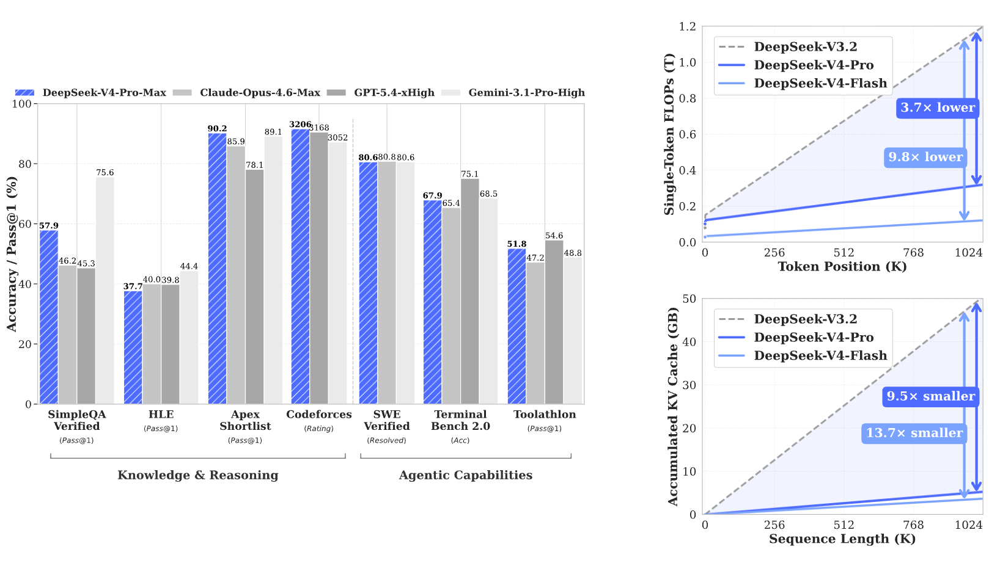
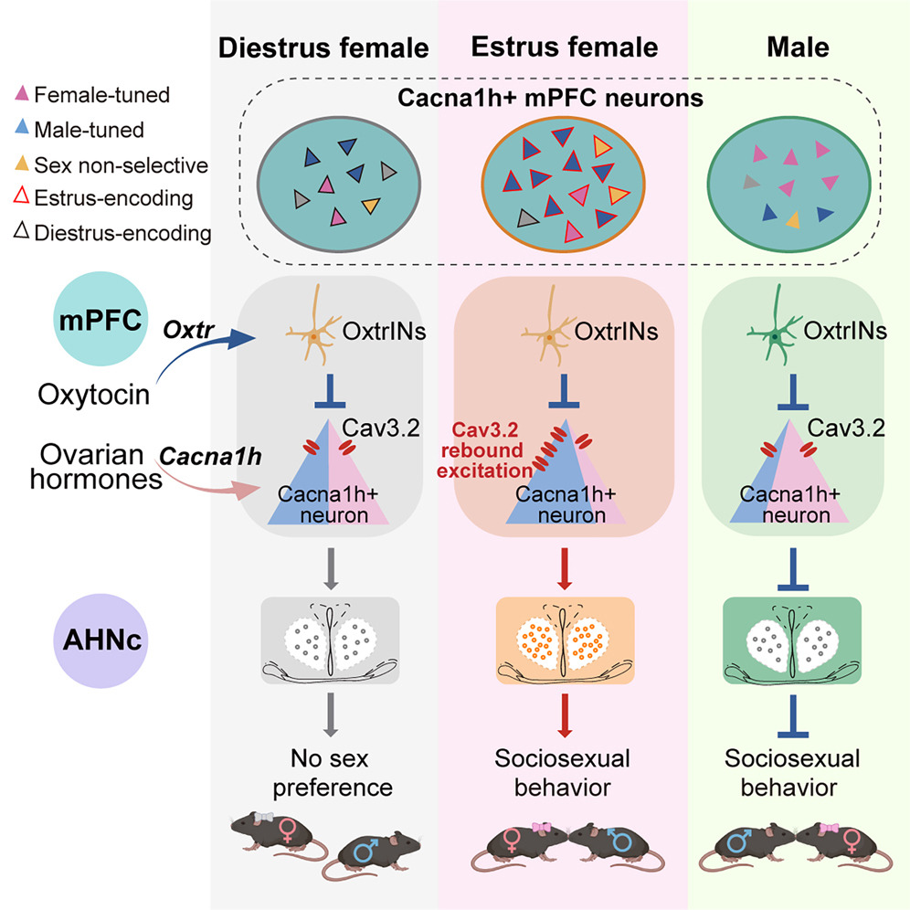

# 👩‍🔬 About Me 

**Hi, I am a PhD student in IDG/McGOVERN INSTITUTE, Tsinghua University.** Contact me through ying-zho22@mails.tsinghua.edu.cn

* * *

# 📰 News!  
* **I focus on understanding mechanisms of continual learning in the brain and improving AI algorithms.** 
* **I dived into the computational neuroscience field in 2023.** Click here to visit our [lab website](https://jiaxx.github.io/).
* **I became a PhD student in 2022.**

* * *

# 👩‍🎓 Experiences 

### - AGI Intern in Pre-training Algorithm & Evaluation Group
  * **DeepSeek, Beijing**
  * _2025/08-Now_

### - Ph.D in Computational Neuroscience
  * **Tsinghua University, Beijing**
  * _2022/09-Now_
  
### - Bachelor in Biotechnology
  * **University of Electronic Science and Technology of China, Chengdu**
  * _2018/09-2022/06_

### - Bachelor in Computer Science (The second degree)
  * **University of Electronic Science and Technology of China, Chengdu**
  * _2018/09-2022/06_

* * *

# 🧠 Interests

**My research interests include**

* **Continual Learning**: My research aims to understand how the brain achieves continual learning. I approach this question from two complementary perspectives:(1) Neural representations. (2) Dynamic neural networks at single-neuron resolution. More specifically, I seek to answer the following questions: How are neural representations reshaped to incorporate novel stimuli (Continual Learning)? How does the brain leverage prior experience to rapidly learn new information (Generalization)? How can new information be integrated without disrupting existing memories (Memory Stability)?

* **NeuroAI Research**: I am curious about the question about what's the difference between biological intelligence and artifical intelligence. How to improve the development of artificial general intelligence by studying the biological brain? My goal is to understand why the brain's architecture is inherently well suited for streaming data, why continual learning is not an additional problem that the brain needs to solve, and how continual learning emerges as a natural capability of its computational architecture.

* * *

# 💯 Learning Notes 
As a first-year doctoral student, learning new knowledge is an important event. I record and share my learning notes, meetings and seminar notes in [Computational Neuroscience Learning Notes](https://energetic-player-d0e.notion.site/Computation-Neuroscience-Learning-e6014d81cdad43e7b20f1d4b36cff4ae). Welcome to make comments.

* * *

# 💗 Lifes and hobbies
I hope to be a vibrant person. From time to time, I would go out to take photos. Currently, I am studying diving. Click [Zoey's Club](https://www.notion.so/Colorful-Life-and-Hobbies-3adaeba927344b9891c90acd84e88dbc) to see photos.

* * *

# 🌼 Publications
<table border="2">
  <tr>
    <td width="60%">
       
Deepseek-AI et al. "Deepseek-v4: Towards highly efficient million-token context intelligence." arXiv (2026).

       
<small> We present a preview version of DeepSeek-V4 series, including two strong Mixture-of-Experts (MoE) language models -- DeepSeek-V4-Pro with 1.6T parameters (49B activated) and DeepSeek-V4-Flash with 284B parameters (13B activated) -- both supporting a context length of one million tokens. DeepSeek-V4 series incorporate several key upgrades in architecture and optimization: (1) a hybrid attention architecture that combines Compressed Sparse Attention (CSA) and Heavily Compressed Attention (HCA) to improve long-context efficiency; (2) Manifold-Constrained Hyper-Connections (mHC) that enhance conventional residual connections; (3) and the Muon optimizer for faster convergence and greater training stability. We pre-train both models on more than 32T diverse and high-quality tokens, followed by a comprehensive post-training pipeline that unlocks and further enhances their capabilities. DeepSeek-V4-Pro-Max, the maximum reasoning effort mode of DeepSeek-V4-Pro, redefines the state-of-the-art for open models, outperforming its predecessors in core tasks. Meanwhile, DeepSeek-V4 series are highly efficient in long-context scenarios. In the one-million-token context setting, DeepSeek-V4-Pro requires only 27% of single-token inference FLOPs and 10% of KV cache compared with DeepSeek-V3.2. This enables us to routinely support one-million-token contexts, thereby making long-horizon tasks and further test-time scaling more feasible. 
       <a href="https://arxiv.org/abs/2606.19348">[Technical Report Link]</a>
    <td width="40%">
      
    </td>

<table border="2">
  <tr>
    <td width="60%">
       
Wang Yuping*, Xinli Song*, Xiangmao Chen*, <b>Ying Zhou*</b>, Jihao Ma*, Fang Zhang*, Liqiang Wei*, Kun Li# et al. "Integrating reproductive states and social cues in the control of sociosexual behaviors." Cell (2025).

       
<small> Female sociosexual behaviors, essential for survival and reproduction, are modulated by ovarian hormones and triggered in the context of appropriate social cues. Here, we identify primary estrous-sensitive Cacna1h-expressing medial prefrontal cortex (mPFCCacna1h+) neurons that integrate hormonal states with recognition of potential mates to orchestrate these complex cognitive behaviors. Bidirectional manipulation of mPFCCacna1h+ neurons shifts opposite-sex-directed social behaviors between estrus and diestrus females via anterior hypothalamic outputs. In males, these neurons serve opposite functions compared with estrus females. Miniscope imaging reveals mixed representation of self-estrous states and social target sex in distinct mPFCCacna1h+ subpopulations, with biased encoding of opposite-sex cues in estrus females and males. Mechanistically, ovarian-hormone-induced Cacna1h upregulation enhances T-type rebound excitation after oxytocin inhibition, driving estrus-specific activity changes and the sexually dimorphic function of mPFCCacna1h+ neurons. These findings uncover a prefrontal circuit that integrates internal hormonal states and target-sex information to exert sexually bivalent top-down control over adaptive social behaviors.
       <a href="https://www.cell.com/cell/abstract/S0092-8674(25)00505-7">[Paper Link]</a>
    <td width="40%">
      
    </td>
